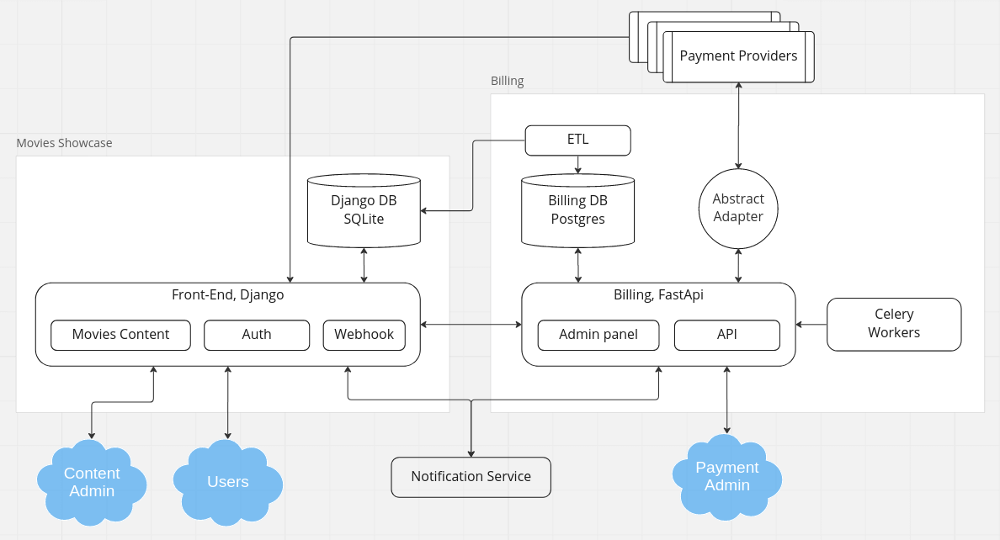
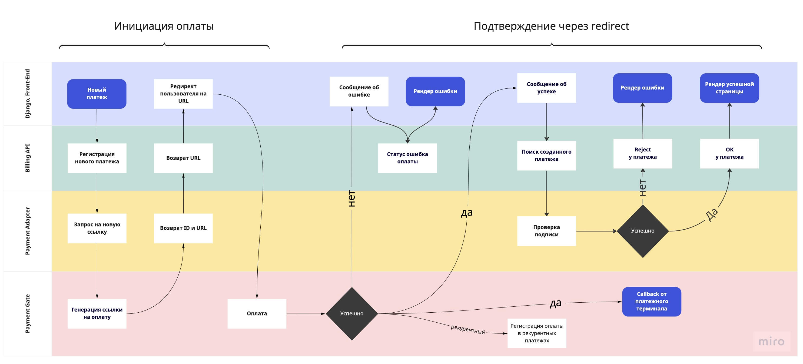
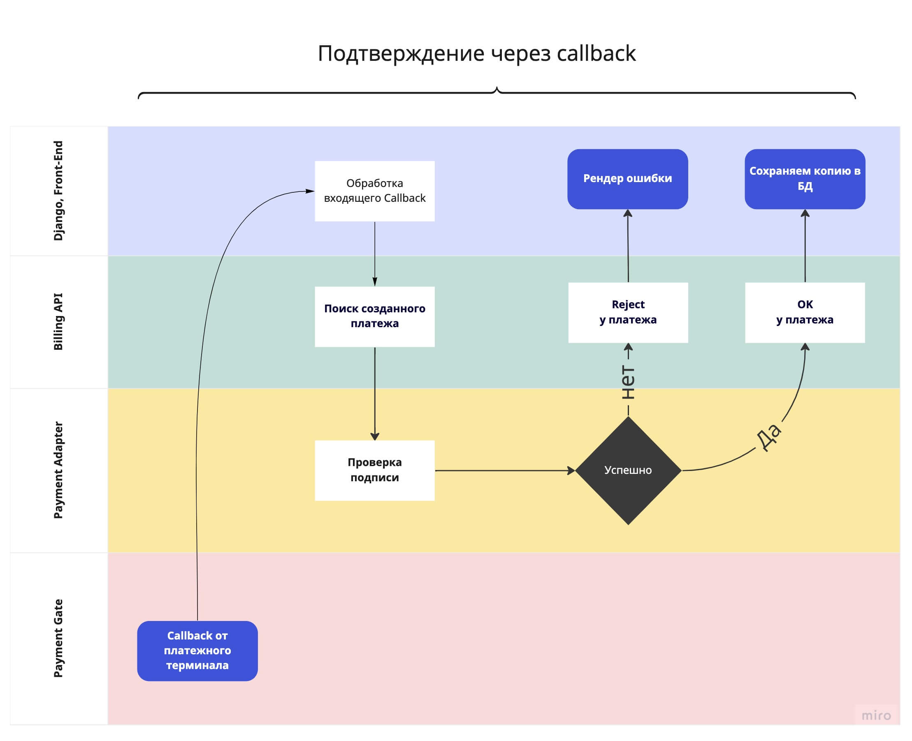

### Архитектура приложения и используемый стэк

1. **Movies Showcase:**
Написан на Джанго и имплементирует в себе фронт-енд часть сервиса клиента, аутентификацию через сессии и Oauth через Google или VK.
База данных специально оставлена SQlite для удобства тестирования проекта с подготовленной небольшой базой 
(в продакшн версии проекта рекомендуется заменить на Postgres)
2. **Billing:**
Написан на Fast-api с использованием асинхронной библиотеки piccolo которая включает в себя Админ панель и асинхронную
ОРМ. Дополнительно рядом крутятся Celery workers для обработки рекуррентных платежей и платежей прошедших не с первого раза
3. **ETL:**
Сервис находится в разработке. Создан для дополнительной верификации и синхронизации базы подписок и купленных фильмов пользователей 
и цен на тарифы по фильмам и подпискам между Джанго и Биллингом
4. **Notification:**
Сервис необходимо доработать и подключить. Подразумевается использование ранее написанного сервиса нотификаций
***
### Основные возможности системы
1. Приём платежей через различные варианты провайдеров (Robokassa, Sberbank, ...)
2. Возможность возврата денег за платёж
3. Покупка конкретного фильма конкретным пользователем
4. Покупка подписки конкретным пользователем
5. Оформление пользователем подписки с повторяющимися (рекуррентными) платежами.
6. Отмена подписки (рекуррентных платежей)
7. Dark theme :)
***
### Диаграммы процессов
1. **Процесс оплаты выглядит так (Django + FastApi)**

- Джанго определяет тип платежа (подписка, покупка фильма) и выбранный клиентом платёжный шлюз и отправляет запрос в биллинг Апи
- Биллинг Апи создаёт новый платеж в своей базе(статус Создан) и формирует ссылку на оплату и передаёт её в ответе
- Джанго перенаправляет клиента по полученному url
- Клиент вводит данные для оплаты
  - платеж успешный: перенаправление клиента на success url, Джанго в фоне забирает параметры из урла и отправляет их на проверку в Биллинг Апи, получив в ответ "ok" показывает страницу успешной оплаты и ссылку или перенаправляет на оплаченный фильм
  - неудачный платеж: шлюз перенаправляет клиента на fail url Джанго запрашивает информацию о неудаче у Биллинг Апи и возвращает её клиенту
- Параллельно в фоне идёт обработка вебхука провайдера на callback url (result), она также перенаправляется в Биллинг Апи и тот в зависимости от результата меняет статус платежа (Успешный или Не прошёл) в своей базе
после чего отдаёт ответ в Джанго и в текущему пользователю обновляется статус подписки или доступ к фильму
2. **Не прошедшие с первого раза платежи (Celery workers)**
- Если не пришёл колбэк от провайдера идёт выборка платежей со статусом "Ожидает колбэка" 
- запрашивается инфо от провайдера
- В разработке: (данные передаются на Django Api для корректного отображения или дожидается синхронизации через ETL процесс)
3. **Рекуррентные платежи** (Celery + FastApi + Django)
- Для обработки рекуррентных платежей запущены Celery workers (рядом с billing api)
- Воркер обходит базу подписок пользователей и выбирает тех у кого есть согласие на рекуррентный платеж и дата 
подписки закончилась (возможны варианты что у пользователя будет лишних пол дня работать подписка мы лояльны 
к данным случаям)
- Биллинг формирует платежи для оплаты и отправляет их в нужные шлюзы(возможны варианты когда все последующие 
рекуррентные платежи обрабатывает сам провайдер, например stripe, но для например для Сбера необходимо 
самостоятельно отправить запрос на списание)
- Джанго обрабатывает вебхук и перенаправляет данные в биллинг для валидации
- Биллинг отвечает успешно или нет прошёл конкретный платеж
- Джанго формирует уведомление на почту пользователю при неудачной попытке снять деньги, или подтверждение и чек 
- Внутри Биллинговой базы подписок пользователей идёт подсчёт 3-х попыток на списание и в 3м неудачном списании
отправляется запрос в Джанго и там устанавливается статус подписки как неактивной
и отправляет письмо о приостановлении подписки через сервис нотификации

  Backoff в случае недоступности провайдера в рекуррентных платежах реализован следующим образом: Celery запускает новую 
пачку платежей со статусом ("подписка закончилась сегодня") каждые 3 часа. Если статус в первый запуск не поменялся, 
будет произведена ещё одна попытка.
***

