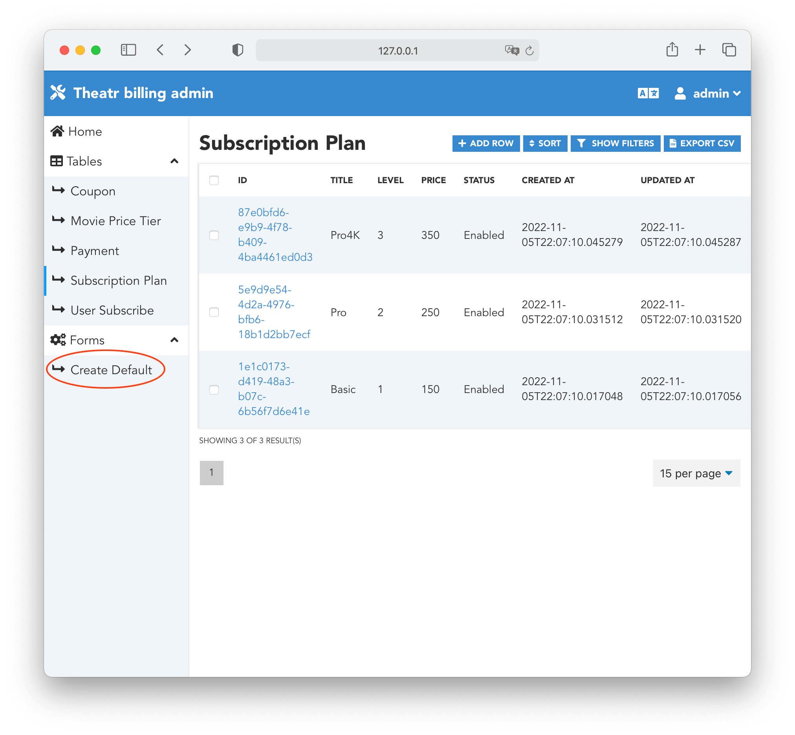

## Запуск проекта
### Вариант № 1
Через докер компоуз поднимается весь проект
```
docker compose up -d
```
### Вариант № 2
Для локальной разработки и тестирования можно поднять в докере только необходимый набор баз данных.
```
docker compose -f docker-compose-local.yaml up -d
```
Сервисы поднять локально (предварительно создать виртуальное окружение и установить все необходимые зависимости)
```
mkvirtualenv billing-projet
pip install -r django-app/requirements.txt
pip install -r billing_app/requirements.txt
pip install -r celery/requirements.txt

cd django_app
python manage.py runserver

cd billing_app/src
piccolo migrations forwards session_auth
piccolo migrations forwards user
piccolo user create
piccolo migrations new billing --auto
piccolo migrations forwards billing
python main.py

cd celery
celery -A worker.celery worker -l info
celery -A worker.celery beat -l info
flower -A worker.celery --port=5555 --broker=redis://localhost:6379/0
```
Так как Django база данных оставлена для тестового примера Sqlite при переходе на продакшн версию (Postgres) необходимо 
запустить миграции и создать суперпользователя
```
python manage.py migrate
python manage.py createsuperuser
```
### Важно!!! 
Для корректной работы необходимо чтобы UUID Подписок (Base, Pro, Pro4K) совпадали в Django и Billing базах данных. Для этого нужно запустить форму создания дефолтых значений.


***
Основной веб фронт интерфейс Джанго расположен по ссылке
```
127.0.0.1:8000/
```
Возможны варианты тестирования работы сервисов с уже созданным юзером Логин `user` и Паролем `user1234`

Так же подключена возможность OAuth2 аутентификации через Google и VK

Админ панель Джанго для контент менеджеров доступна по ссылке с Логином `admin` и Паролем `admin`
```
127.0.0.1:8000/admin/
```
Документация Swagger Billing Api доступна по ссылке
```
127.0.0.1:5000/docs/
```
Админ панель системы оплаты доступна по ссылке с Логином и Паролем из `piccolo user create`
```
127.0.0.1:5000/admin/
```
Flower dashboard доступен по ссылке
```
127.0.0.1:5555/
```